# 项目记录与概述

本项目主要是利用 **MediaPipe** 来提取手部关键点的**特征信息**，获得数据的相对坐标后投喂给**机器学习 (Machine Learning)**，采用基础的**随机森林 (Random Forest)** 模型进行学习。

## 具体过程记录

### 初步选定动作

一开始选定了这六个手势动作并命名：

- ✌️ peace
- ✊ fist
- ✋ palm
- 🤟 love_you
- 🤙 call_me
- 👉 finger_gun

考虑的因素有：一是手势的简单性，想要保证足够的正确率；二是拍摄的便捷性，最后运行程序时会打开笔记本电脑内置的前置摄像头,对于录制的视频数据要有相同的展示面，而组员拍摄时用自己的手机后置拍摄更为方便，所以选择相对容易反转实现的手势。

### 录制素材

实现机器学习每个手势动作都需要提供很多照片，采用录制视频再隔几帧抽取照片的办法最为高效。通过处理可以实现在手机端进行拍摄。

例如，对于🤟love_you 这个动作，左图展示了运行文件时在电脑前置摄像头比出的动作，右图展示了录制视频时便捷的拍法，都展示了手的背面。

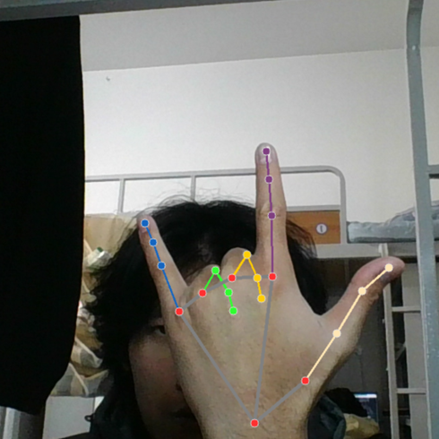  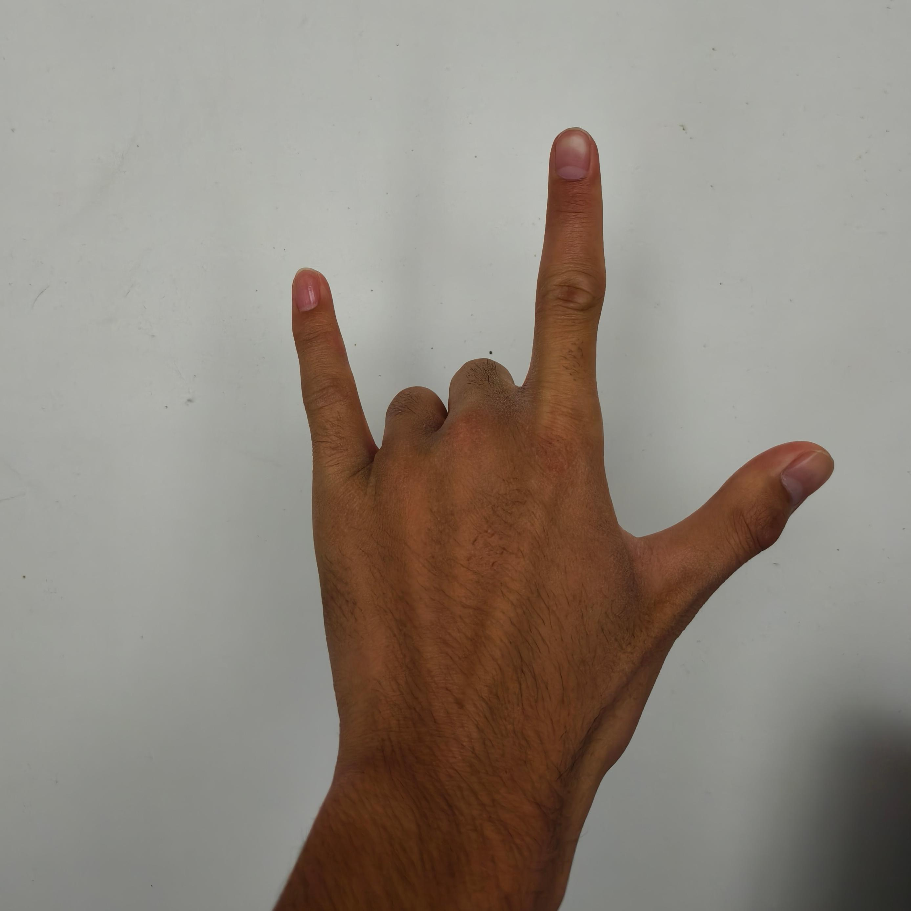

六个手势中，✌️peace 、✊fist 、✋palm 、🤟love_you 均可采用这样的方法拍摄，较为便捷。

对于另外两个旋转很别扭的手势🤙call_me 、👉finger_gun 也有一些处理技巧，通过舒适的摆放角度拍摄后，通过剪辑来达到正确的目标。

如图所示，拍摄时左手比动作，右手持手机拍摄。最后通过旋转转到合理的角度。

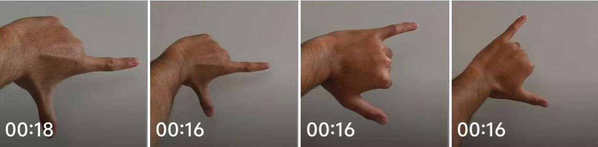

为保证全面性，一共 5 个人参与录制视频，每人每个手势动作拍摄 4 个长度约为 15 秒的视频，共计 $5\times6\times4=120$ 个视频。

因为很多视频拍摄不达标，实际拍摄远超这个数目。过程中确实发现不同人之间手势的控制情况确实不一样，因此确实有必要多人拍摄。

环境最好干净，照明最好受控，不能产生光影影响。受实际情况限制，未能在一个统一的条件下组织拍摄，所以视频的环境不同，采用的摄像头也不同，但总体影响不大, MeidaPipe 能提取出坐标来就能基本满足我们的需求，并从根本上消除了背景、光照、肤色等表观因素对识别性能的影响。

拍摄中遇到一些容易有的问题，可能由于大家的控制习惯不同或者理解不同，也会有偏差，都需要严格把关，下面是一些常见问题：

- 拍摄手法不统一，拍摄别扭或者视频未进行旋转
- 👉finger_gun 大拇指太松懈，没有伸直
- 🤟love_you 有人的小拇指格外张开，不符合常规
- ✋palm 五指没有明显打开
- 很多视频角度不对或者没有露出手部关键点

值得一提的是，开始下达了每组 4 个视频中，一组远、一组近、一组向左微斜、一组向右微斜，但其实从后面的经验来看并没有什么太大的必要，本身就有一定的弹性范围，而且由于个别视频倾斜幅度有点大反而污染了训练结果。

下图是我个人拍摄并处理完的结果。

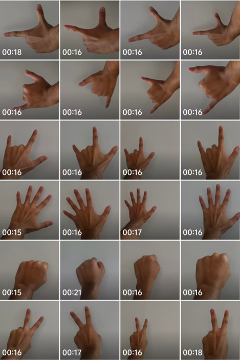

对原视频采用合适的命名及结构存储，便于后续使用。以下是我们的存储结构：

``` text
gesture_recognition_project/
├── data/
│   └── raw_videos/
│       ├── peace/
│       │   ├── XuYian/
│       │   │   ├── XuYian_peace_1.mp4
│       │   │   ├── XuYian_peace_2.mp4
│       │   │   ├── XuYian_peace_3.mp4
│       │   │   └── XuYian_peace_4.mp4
│       │   ├── SheYulu/
│       │   │   ├── SheYulu_peace_1.mp4
│       │       └── ...
│       ├── fist/
│       └── ...
```

### 坐标提取

[`1_data_processing.py`](./scripts/1_data_processing.py) 中对数据进行处理并提取坐标信息。下面是一些重要部分，其它部分可参考代码，也进行注释学习了。

**convert_to_relative(raw_landmarks)** 函数是用来将相对绝对转化成相对坐标的。该函数以手腕为原点基准，将 raw_landmarks 中的 63 个绝对坐标 [x0,y0,z0, x1,y1,z1, ...] 转化成 relative_landmarks 中 63 个相对坐标 [x0-x0,y0-y0,z0-z0, x1-x0,y1-y0,z1-z0, ...]

``` py
def convert_to_relative(raw_landmarks):
    relative_landmarks = []
    if len(raw_landmarks) < 63:
        raise ValueError(f"Expected 63 coordinates, got {len(raw_landmarks)}")
    # 手腕坐标（基准点）- 点0
    wrist_x = raw_landmarks[0] 
    wrist_y = raw_landmarks[1]  
    wrist_z = raw_landmarks[2]
    # 计算所有21个点相对于手腕的坐标
    for i in range(0, len(raw_landmarks), 3):
        rel_x = raw_landmarks[i] - wrist_x
        rel_y = raw_landmarks[i+1] - wrist_y
        rel_z = raw_landmarks[i+2] - wrist_z
        relative_landmarks.extend([rel_x, rel_y, rel_z])
    return relative_landmarks
```

我们一开始直接使用 MediaPipe 提取的绝对坐标，后来发现使用相对坐标才更加合理，这样消除了不同拍摄距离、手部位置等因素带来的尺度差异，让模型专注于手势本身的几何关系。

**extract_features_from_video(video_path)** 函数初始化了 MediaPipe 手部检测，隔 5 帧处理原始图像，并进行镜像数据增强。

初始化 MediaPipe 手部检测,其中只检测单只手，设置适当的置信度阈值以保证检测质量。

``` py
with mp.solutions.hands.Hands(
    static_image_mode=False,
    max_num_hands=1,
    min_detection_confidence=0.5,
    min_tracking_confidence=0.5
) as hands:
```

对原始图像进行处理，其中隔 5 帧抽取 1 张照片，避免连续帧间的高度相似性并提高数据多样性。最后从 MediaPipe 返回的 landmark 对象中提取 x、y、z 三维坐标，组成 63 维特征向量。

``` py
while True:
    ret, frame = cap.read()
    if not ret:
        break
        
    total_frames += 1
    if total_frames % frame_interval != 0:
        continue

    # OpenCV 和 MediaPipe 使用不同的颜色格式
    rgb_frame = cv2.cvtColor(frame, cv2.COLOR_BGR2RGB)
    results_original = hands.process(rgb_frame)

    if results_original.multi_hand_landmarks:
        # 1. 提取原始绝对坐标
        frame_detected = True
        raw_landmarks = []
        for landmark in results_original.multi_hand_landmarks[0].landmark:
            raw_landmarks.extend([landmark.x, landmark.y, landmark.z])
        # 2. 转换为相对坐标
        relative_landmarks = convert_to_relative(raw_landmarks)
        original_landmarks.append(relative_landmarks)
```

需要对视频进行镜像再次识别，目的是为了能同时满足左右手的检验。为此我们把原来👉point_right 的命名改名为👉finger_gun 。

``` py
frame_mirrored = cv2.flip(frame, 1)  # 1代表水平翻转
rgb_mirrored = cv2.cvtColor(frame_mirrored, cv2.COLOR_BGR2RGB)
results_mirrored = hands.process(rgb_mirrored)

if results_mirrored.multi_hand_landmarks:
    # 提取镜像图像的绝对坐标
    frame_detected = True
    raw_mirrored = []
    for landmark in results_mirrored.multi_hand_landmarks[0].landmark:
        raw_mirrored.extend(
            [landmark.x, landmark.y, landmark.z])
    # 转换为相对坐标
    relative_mirrored = convert_to_relative(raw_mirrored)
    mirrored_landmarks.append(relative_mirrored)
```

有两种思路得到镜像的数据，一种是直接对称原视频提取的坐标，另一种是对称原视频后再次提取。一开始我们采用前者，后来还是更换为后者，这样才更加接近 MediaPipe 的本质，更能模拟环境识别，加强对数据的检验和利用。后续我们发现，确实很多镜像图片得到的数据并不跟原始数据一致。

**process_all_videos()** 函数进行批量视频处理。记录每个视频的检测率和处理状态，便于后续分析数据质量记录每个视频的检测率和处理状态，便于后续分析数据质量。

``` py
#遍历所有视频
def process_all_videos():
    for gesture in os.listdir(RAW_VIDEOS_PATH):
        gesture_path = os.path.join(RAW_VIDEOS_PATH, gesture)
        ...
        for person in os.listdir(gesture_path):
            person_path = os.path.join(gesture_path, person)
            ...
            for i in range(1, 5):
                video_file = f"{person}_{gesture}_{i}.mp4"
                ...
                original_features, mirrored_features, quality = extract_features_from_video(video_path)
                ...
                # 保存特征数据
                for landmarks in original_features:
                    all_features.append(landmarks + [gesture])
                for landmarks in mirrored_features:
                    all_features.append(landmarks + [gesture])
```

### 划分数据集

划分数据集也写在了 [`1_data_processing.py`](./scripts/1_data_processing.py) 中。采用 7:1:2 的比例划分训练集、验证集和测试集，使用分层抽样确保各类别比例一致。63 个特征按 x0,y0,z0,x1,y1,z1,...,x20,y20,z20 的顺序命名，清晰对应 21 个手部关键点。另外采用时间管理，每次处理生成带时间戳的新版本，避免覆盖历史数据。

``` py
def save_datasets(features_data, quality_data):
    ...
    version = datetime.now().strftime("%Y%m%d_%H%M%S")
    version_folder = os.path.join(PROJECT_ROOT, "data", "processed", f"version_{version}")
    ...
    columns = []
    for i in range(0, 21):
        columns.extend([f'x{i}', f'y{i}', f'z{i}'])
    columns.append('label')
    
    full_df = pd.DataFrame(features_data, columns=columns)
    
    from sklearn.model_selection import train_test_split
    X = full_df.drop('label', axis=1)
    y = full_df['label']
    
    X_temp, X_test, y_temp, y_test = train_test_split(
        X, y, test_size=0.2, random_state=42, stratify=y
    )
    X_train, X_val, y_train, y_val = train_test_split(
        X_temp, y_temp, test_size=0.125, random_state=42, stratify=y_temp
    )
```

### 初步提取展示

输出的结果中有对各个视频进行处理并展示提取样本数量。下面以🤙call_me 中 XuYian 的展示结果为例说明，左图是原先采用坐标镜像得到的结果，中边是后来采用图像镜像得到的结果，可以看到数量并不一致，后续也会继续遇到这种问题。右图是其他组员更极端的情况，镜像图片有些甚至一张样本都提取不出来

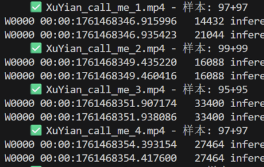  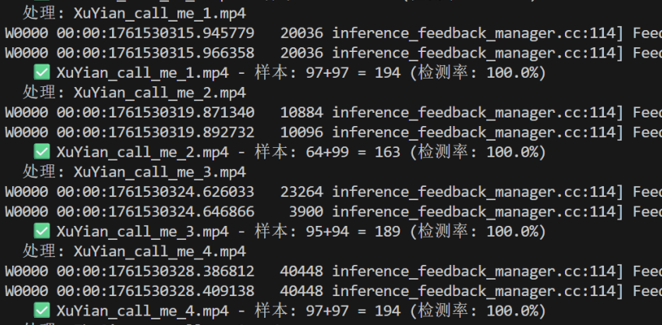  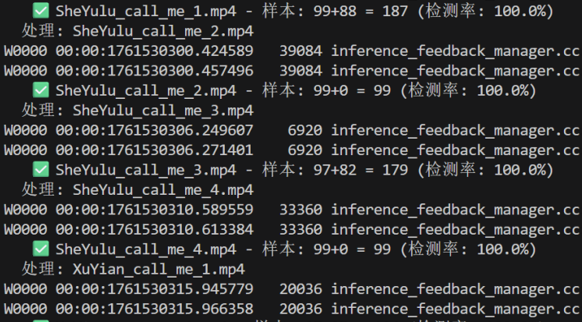

但总体获得了相对客观的样本数量，纠结了很久原因无果，我们选择接受数据的不完美，继续往后推进进度。下图是得到的样本数量展示。

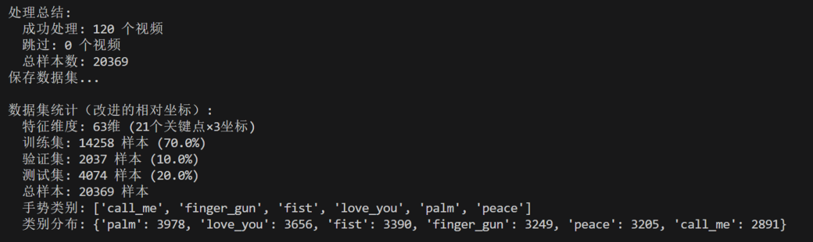

`quality_report.csv` 生成每个视频的质量报告，`version_info.json` 包含版本信息，`full_dataset.csv` 、`train_dataset.csv` 、`val_dataset.csv` 、`test_dataset.csv` 分别是总数据集、训练集、验证集、测试集的具体相对坐标信息。由于最终只上传了最终版的信息，所以仅作参考。

### 模型建构

[`2_model_training.py`](./scripts/2_model_training.py) 主要实现模型的训练。

**find_latest_data_version()** 自动找寻最新版本。如前文提到的，引入了对时间版本的管理，所以方便进行训练。

``` py
def find_latest_data_version():
    ...
    # 找到所有版本文件夹
    versions = [d for d in os.listdir(processed_dir) if d.startswith("version_")]
    ...
    # 返回最新的版本
    latest_version = sorted(versions)[-1]
    return os.path.join(processed_dir, latest_version)
```

**parameter_search(X_train, y_train, X_val, y_val)** 在加载完数据集后进行训练，遍历不同的树数量和深度组合，找到随机森林模型的最优参数。

``` py
def parameter_search(X_train, y_train, X_val, y_val):
    ...
    param_grid = {
        'n_estimators': [50, 100, 150],    # 树的数量
        'max_depth': [10, 15, None],       # 树的最大深度
    }
    ...
    for n_est in param_grid['n_estimators']:
        for max_d in param_grid['max_depth']:
            print(f"尝试参数: n_estimators={n_est}, max_depth={max_d}", end="")
            # 训练模型
            model = RandomForestClassifier(
                n_estimators=n_est,
                max_depth=max_d,
                random_state=42
            )
            model.fit(X_train, y_train)
            ...
```

**evaluate_final_model(model, X_test, y_test)** 使用测试集进行最终评估，输出准确率、分类报告和混淆矩阵，全面评估模型性能。

``` py
def evaluate_final_model(model, X_test, y_test):
    #在测试集上评估最终模型
    ...
    y_test_pred = model.predict(X_test)
    test_accuracy = accuracy_score(y_test, y_test_pred)
    # 详细分类报告
    print(classification_report(y_test, y_test_pred))
    # 混淆矩阵
    cm = confusion_matrix(y_test, y_test_pred)
    ...
```

同样的，**save_model_and_results(model, best_params, val_accuracy, test_accuracy, search_results)** 生成带时间戳的版本，便于追踪和比较不同版本的性能。

### 初步模型训练结果

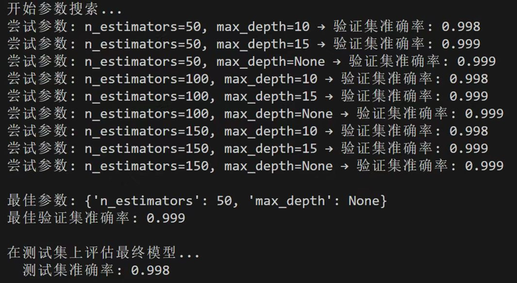  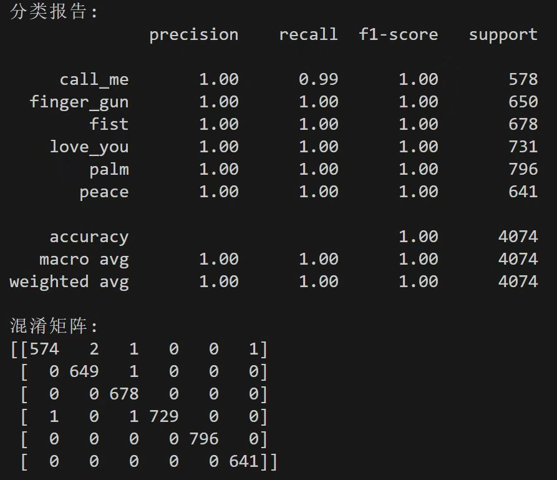

可以看到，静态训练检验的结果非常可观！不管什么参数都有 99.8% 以上的得分，所有报告都非常可观，给我们极大的信心。混淆矩阵可以看出，主要是🤙call_me 的误判比较多，虽然数量少并不能绝对地下定论。

### 实时检测

[`3_real_time_test.py`](./scripts/3_real_time_test.py) 主要实现打开摄像头，提取一帧比对训练好的模型。增添了直观的视觉反馈，包括关键点绘制和颜色编码的置信度显示。实现实时帧处理循环，提供完善的异常处理和资源清理，确保程序稳定运行。

### 初步实时检测结果

总体表现良好，不如静态测试表现那么良好。经过测试发现手势收到角度、远近、环境亮度等因素影响大。两手结果相似，图像镜像再提取发挥作用。一些动作正反展示坐标信息相近也可以识别出来。

四个较为简单的手势表现十分出色，下图依次展示✋palm 、🤟love_you 、✊fist 、👉finger_gun 的结果实例。

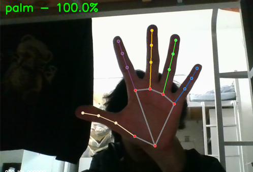  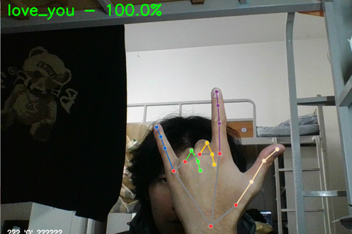  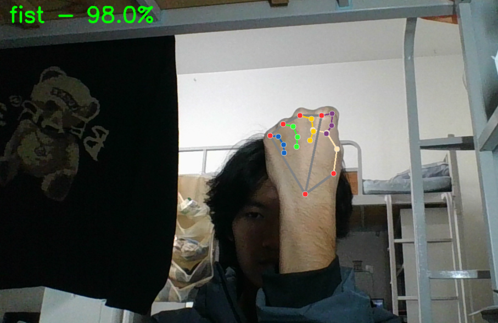  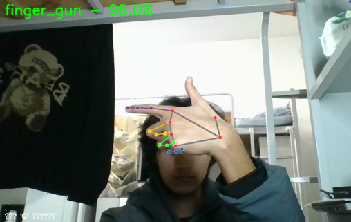

✌️peace 的结果也能过关，但是是受环境因素、正反角度影响最大的。下图中第一组展示了站立明亮条件下正反手情况，第二组展示了坐着昏暗条件下正反手情况，第三组展示了倾斜一定度数也会带来得分差异。

  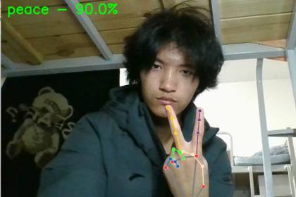  
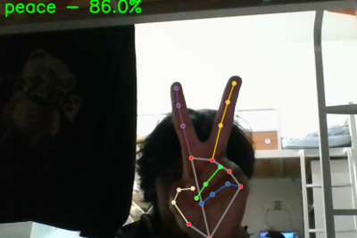  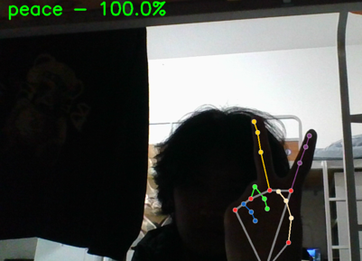  
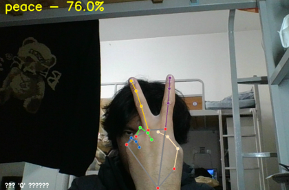  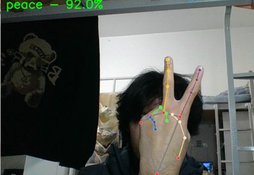

表现差的是🤙call_me 。可见🤙call_me 向内倾斜 45°-80° 下识别准确（96%-100%），甚至向内倾斜 90° 仍有优秀的得分（90%）。🤙call_me 向外倾斜 10°-45° 被模糊识别为👉finger_gun 。🤙call_me 反手虽不合法但仍被识别为🤙call_me ，并且角度不合适还会被识别为🤟love_you 。

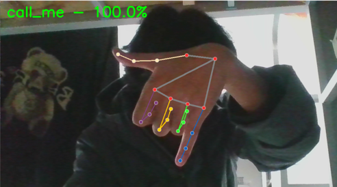  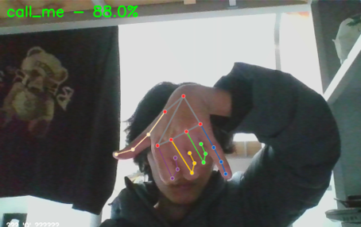  
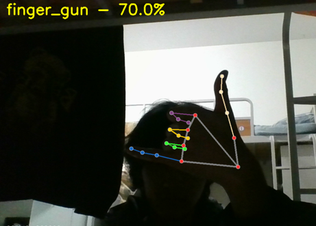  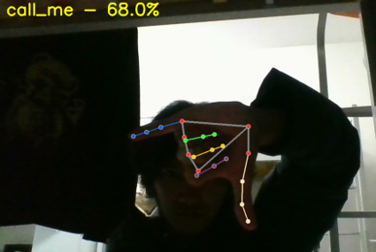  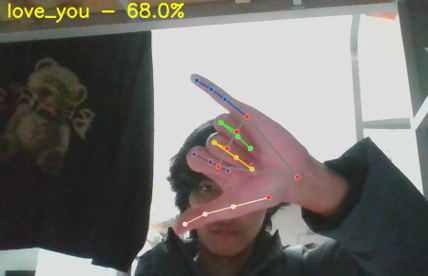

所以初步实时检测结果表明，问题主要出在🤙call_me 上，需要重点研究。

### 聚焦🤙call_me 的研究

观察录制的素材，发现可能的原因：

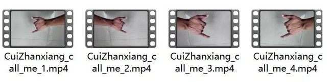  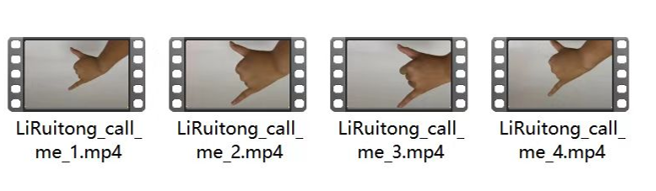  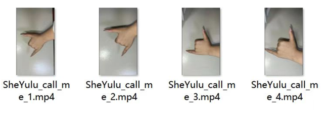  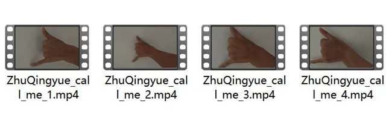  

1. 拍摄时引入不必要的旋转，如前文提及，反而污染了结果，导致最佳得分的手势偏转过大
2. 拍摄角度不对，没有露出手指的第二个关键点，导致关键坐标差距大，影响训练结果
3. 摆放不切合实际，实际摆放🤙call_me 不会这么竖直、僵硬，会带来各个方向的角度变化，应当模拟实际情况

为此我们考虑重新拍摄视频素材，如下图展示，不仅仅是拍入这么多关键点，还采用更加真实的前置镜头拍摄，更能模拟真实场景和角度，如整体的前后层次更加清晰，小拇指比大拇指更靠近镜头。

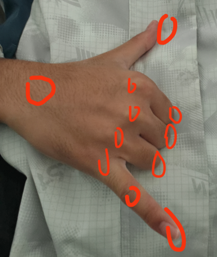

下面是重拍完的展示。

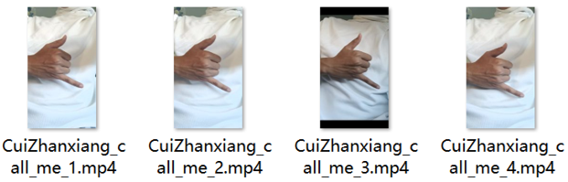  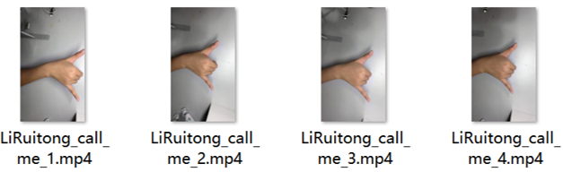  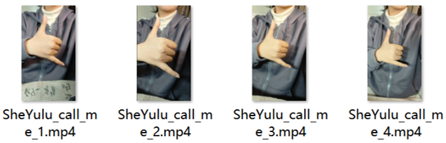  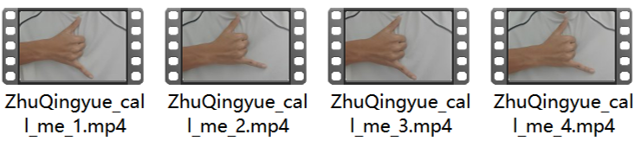  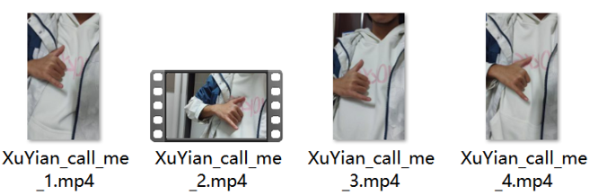

因为之前引入对时间的管理，所以直接替换原来的视频，保持同样的命名和文件夹结构，重新运行 [`1_data_processing.py`](./scripts/1_data_processing.py) 、 [`2_model_training.py`](./scripts/2_model_training.py) 即可重新训练模型，然后通过 [`3_real_time_test.py`](./scripts/3_real_time_test.py) 检测实时条件下新的结果。

重拍完的🤙call_me 手势确实提取了更多的样本，从原来的2891张到3520张，虽然并没有严格统一视频的时长，但还是能反映出这次统一的要求下更容易提取出样本，尤其是镜像条件下。可以看到以下静态训练结果，静态训练检验的得分情况依然非常可观，少有的几个错误也还是🤙call_me 和👉finger_gun 的误判。

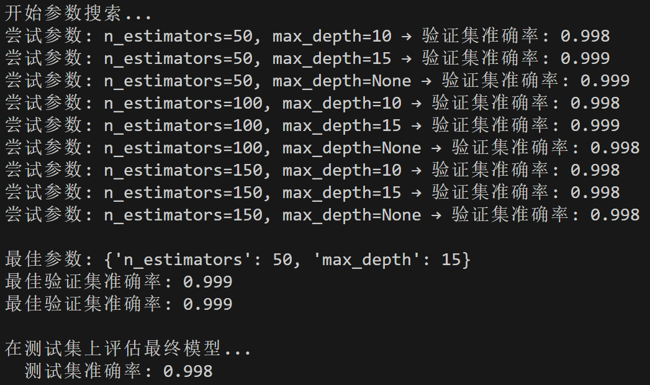  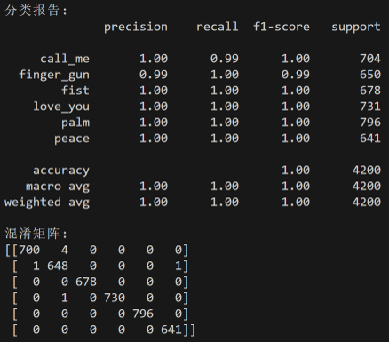

但是新的实时结果依然不是很理想，如下图所示，需要过多露出手指的第二关节才能有较高的得分，这一现象被放大，同时像原先一样露出手背较多还容易被误识为👉finger_gun 并有较高的得分，整个手势对于角度的要求过于严苛。

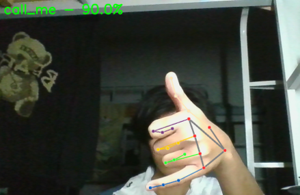  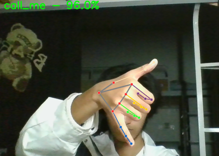  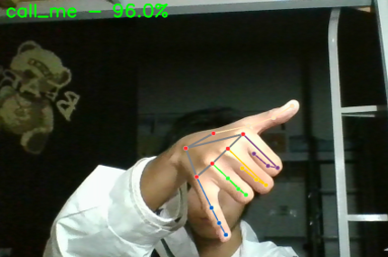  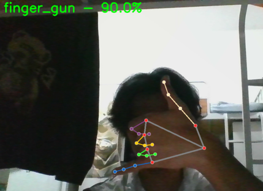

经过反复拍摄和重新训练，问题依然严重存在。这也许对于我们框架下的设计来说并不是一个好动作。为此我们决定重新设计一个动作👌ok 。

### 关于新动作👌ok 的研究

起初我们以为这是个简单的动作，能有很高的正确率。但是没想到录完了第一轮的素材，得到了跟之前一样的静态训练结果，但实时检测结果很差，无论怎么样都无法有个优秀的得分，更别提给一个合理的手势动作打高分了。为此我们检查了录制的素材，初步找到可能的原因：

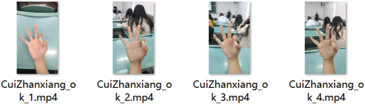  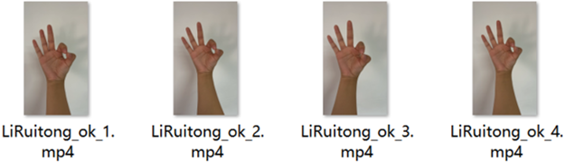  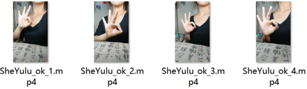  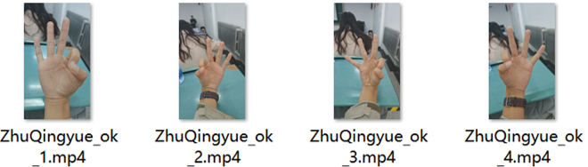  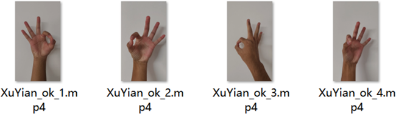

1. 以为这是个简单动作过于松懈，下达的指令比较简单，也没有好好研究真实镜头前应该有的样子，给的样图有点偏差
2. 这个动作本身就受角度影响非常大，我以为让组员按照样图拍摄我自己拍些奇怪角度来增强多样性，而其实这是不符合机器学习的能力的，反而弄出了个四不像

我找了我的朋友们来帮我重新拍摄素材。这次我严格要求了动作的规范：

1. 使用前置摄像头，更加真实
2. 露脸拍摄，将👌ok 的圈比在眼睛前，同时严格把关手掌露出的面积以及三根指头的角度，这样有统一的标准来保证数据的规范

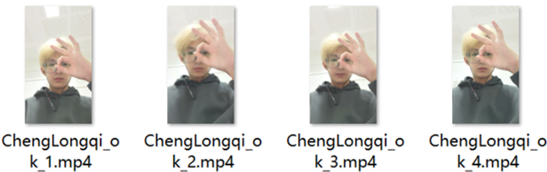  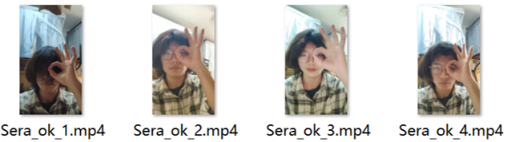  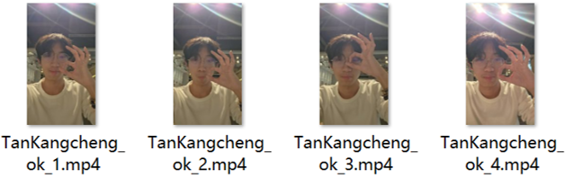  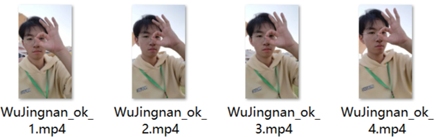  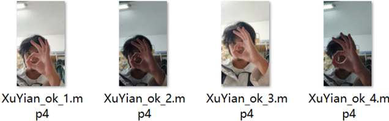

经过反复多轮的拍摄后，初步得到重新拍摄的结果。虽然静态训练结果还是不变的高得分，但也发现了一个明显的问题，朋友们的镜像图像再提取得到的样本数量非常少，实时检测也确实反映出对应的问题。


上图是 [`1_data_processing.py`](./scripts/1_data_processing.py) 一部分的提取结果，可以看到镜像样本很少。下图是实时摄像头下的检测结果，同样的动作，一只手会比另一只手更容易识别出来，获得更高的得分。

    

这里加深了我们对于数据的理解，需要获取一定数量的镜像数据才能统一左右手的识别结果。从经验中可以得出，大概率是因为他们视频里将明亮的光源给录进去了，导致画面中光线不均匀。至于为什么这样 MediaPipe 就难以识别镜像后的图像我们也无法解释，很多视频明明看起来没什么差别却就是提取不出，并且这不是一个随机事情，重复对视频进行提取，每次得到的结果是一样的。也正因如此，又得益于代码和文件夹有良好的结构，所以可以直接剥离其余的动作，👌ok 文件夹底下也可以把其余无关人给剥离，确保一次留下这个人的四个👌ok 视频即可，这样可以快速运行 [`1_data_processing.py`](./scripts/1_data_processing.py) 进行检验提取的样本数量。

我们利用上述经验和技巧，选择合适的环境，重新拍摄经过预检验的视频素材，得到了最终的模型和结果。

        

总共得到4115张👌ok 样本，下图是最终版的模型静态训练结果。

  

实时检测的结果有点难评，也算是引起我们的思考了吧。下面是一些结果，可以看到高得分对角度比较严格，识别也没那么灵敏，角度发挥了很大的作用。多次调整依然无法使👌ok 手势像前面简单手势一样获得较高评分。

      

以上便是我们最终的模型。

## 思考与展望

了解到手势识别有静态的和动态的区分，静态较为简单已有较为成熟的研究，我们的设计本质上是一个静态的分类问题。

另一方面， MediaPipe 有较强的准确性和方便性，在各方面有广泛的应用，通过其提取的坐标特征信息，简单的随机森林模型就能有 99.8% 以上的得分，显然已经没有必要再探究这种框架下还有没有更合适的模型。

静态识别另一常见的方法是采用**深度学习**的方法，直接对图片像素进行学习。

本项目的框架很好地利用了坐标信息，对提取出来的坐标信息进行大量的矩阵运算恰恰是计算机最善长的事，显然它具有更强的可解释性，利用更少的样本数量以及更低级的cpu级别的算力即可得到很高的得分。但是，这种便捷性只适合简单的动作，如本项目的✋palm 、🤟love_you 、✊fist 、👉finger_gun ，只需要对手指进行伸缩，很容易判别。复杂的动作，涉及到角度和远近的层次，一点点的偏差在人眼里可能变化不大，但在机器眼里就可能是一个大变化，很多关键点、关键向量的结构直接发生变化。因此，它并不适用与复杂的动作，且过于依赖特征提取，在实际的复杂环境中常常无法有效地提取，实用性相对不高。

> 例如，🤙call_me 这个手势比想象的复杂，它涉及到的展示面可能并不固定，我们的拍摄形式很难让每个人的视频角度完全一致，加上有些人的骨骼差异执行标准动作时不够自然，略微一点点轻微的变化可能就不断积累，通过静态的分类比较容易，但想在实时摄像头下拿个高得分就不太行。这样的情况下若想提高得分，一个猜想是每个动作自己设计需要的关键向量作为数据输入，这样也许可以削减角度带来的影响。👌ok 也具有这样的问题，在尽可能统一标准后，以我的最适摆放姿势得分一般，稍微旋转一下角度就有明显不同的得分差异。一个经验是，一个手势摆的不够自然的视频会很污染整个模型训练。

而采用深度学习的框架，理论上来说会在这方面做得更好，难度不在于 MediaPipe 提取坐标了，而是优质数据的处理以及机器能否发现其中的规律，虽然需要更多的数据和更大的算力，整个过程也更加黑箱，但是会更具有泛化能力，满足更大范围的需求。

后续，我们一方面会继续查阅文献资料，拓展知识和认知，另一方面会继续使用卷积神经网络进行新的手势识别项目探究，并对比二者，形成报告。
